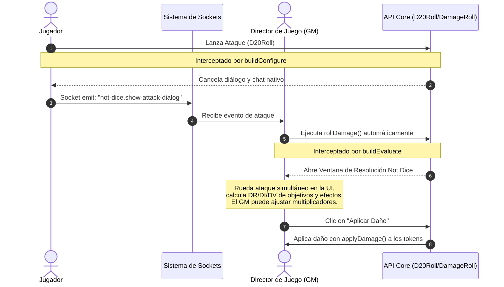

# Guía de Referencia: Módulo Not Dice (Foundry VTT)

Este documento sirve como referencia técnica sobre la arquitectura, funcionamiento, flujos de trabajo e integraciones del módulo **Not Dice**. Está diseñado para guiar a desarrolladores y modelos de IA en futuras modificaciones.

---

## 1. Descripción General

**Not Dice** es un módulo para **Foundry Virtual Tabletop (VTT)** (diseñado para versiones 13 y 14) optimizado para el sistema **dnd5e** (v4+). Su propósito principal es agilizar el combate simplificando y unificando el flujo de tiradas de ataque y daño:
- **Tirada Simultánea de Ataque:** Evita los diálogos nativos separados y calcula la tirada de ataque directamente en el cuadro de resolución de daño del Director de Juego (GM).
- **Resolución Unificada de Daño:** Ofrece un diálogo interactivo al GM donde se consolidan el ataque, los objetivos afectados, sus resistencias/inmunidades/vulnerabilidades (DR/DI/DV), modificadores adicionales (maestrías de armas, dotes, efectos activos) y se aplica el daño directamente en un solo clic.
- **Detección Automática de Áreas de Efecto:** Intercepta la creación de plantillas de medición y regiones para detectar tokens afectados y abrir un diálogo de salvaciones y daños.
- **Traducción en Tiempo Real:** Traduce descripciones de habilidades y hechizos del inglés al español a través de la API gratuita de MyMemory.

---

## 2. Estructura de Archivos del Proyecto

El módulo está estructurado como un módulo estándar de Foundry VTT:

```text
not-dice/
├── module.json                # Metadatos del módulo, scripts y estilos
├── styles/
│   └── not-dice.css           # Estilos personalizados para los diálogos y fichas
├── scripts/
│   ├── constants.js           # Constantes, traducciones de estados y estilos de daño
│   ├── settings.js            # Registro de configuraciones en Foundry
│   ├── description-parser.js  # Procesamiento y enriquecimiento de HTML de ítems
│   ├── damage-effects.js      # Escaneo de efectos activos que aumentan daño
│   ├── saving-throw.js        # Intercepción de áreas de efecto y salvaciones
│   └── module.js              # Núcleo del módulo (parcheo de tiradas de d20 y daño)
└── .github/
    └── agents/
        └── foundry-vtt.agent.md # Directrices específicas para el agente de IA
```

*Nota: Durante el empaquetado/despliegue se genera un directorio duplicado `not-dice/` y un archivo `not-dice.zip` en la raíz.*

---

## 3. Análisis Detallado de los Archivos

### 3.1 [module.json](file:///d:/Foundry/FoundryVTT/Data/modules/not-dice/module.json)
Define los metadatos. Puntos clave:
- **Compatibilidad:** Mínima v13, verificada v14.
- **Sistemas:** Requiere `dnd5e`.
- **Scripts (esmodules):** Carga los módulos ES en orden de dependencia.
- **Estilos:** Carga `styles/not-dice.css`.
- **Sockets:** Habilita `"socket": true` para la comunicación entre GM y jugadores.

### 3.2 [scripts/constants.js](file:///d:/Foundry/FoundryVTT/Data/modules/not-dice/scripts/constants.js)
Define variables globales bajo el namespace `globalThis.notDiceConstants`:
- `statusES`: Mapeo de estados/condiciones de dnd5e al español (ej. *blinded* -> *Cegado*).
- `damageStyle`: Estilos visuales (colores HSL/RGB, fondos y bordes) asignados a cada tipo de daño en los diálogos interactivos.
- `multiplierOptions`: Lista de multiplicadores de daño aplicables a los objetivos (Curar (-1), x0, x1/4, x1/2, x1, x2).

### 3.3 [scripts/settings.js](file:///d:/Foundry/FoundryVTT/Data/modules/not-dice/scripts/settings.js)
Registra los ajustes en Foundry bajo el namespace `"not-dice"`:
- `enableSimultaneousRoll` (Boolean): Realiza la tirada de ataque automáticamente al abrir el diálogo de daño.
- `enableSound` (Boolean): Sonidos de dados nativos si el módulo *Dice So Nice* no está activo.
- `enableTemplateIntercept` (Boolean): Intercepta plantillas/regiones para abrir el panel de salvación de área.
- `enableTranslation` (Boolean): Habilita traducción con MyMemory.
- `myMemoryEmail` (String): Permite ingresar un correo para expandir la cuota de traducción diaria.

### 3.4 [scripts/description-parser.js](file:///d:/Foundry/FoundryVTT/Data/modules/not-dice/scripts/description-parser.js)
- Proporciona `enrichItemDescription(item)`.
- Utiliza el método nativo `TextEditor.enrichHTML` pasando el documento original como `relativeTo` (ej. `relativeTo: item`). Esto es crítico en dnd5e v4+ para que Foundry resuelva referencias dinámicas a actividades (`activity=id`).
- Se expone como global en `globalThis.notDiceEnrichDescription`.

### 3.5 [scripts/damage-effects.js](file:///d:/Foundry/FoundryVTT/Data/modules/not-dice/scripts/damage-effects.js)
- Proporciona `getDamageIncreasingEffects(actor)`, expuesta globalmente en `globalThis.notDiceGetDamageEffects`.
- Inspecciona los efectos activos aplicados en el actor para identificar bonificadores de daño (ej. *Marca del cazador*, *Favor divino*, *Ataque furtivo*).
- Criterios de detección: palabras clave en el nombre, claves del array de cambios (`changes`) que afecten a `bonuses.damage`, flags específicas de módulos de automatización (como DAE o Midi-QOL) o análisis del ítem origen del efecto.

### 3.6 [scripts/saving-throw.js](file:///d:/Foundry/FoundryVTT/Data/modules/not-dice/scripts/saving-throw.js)
Gestiona la intercepción de áreas de efecto (AoE):
- **Hooks:** Escucha `createRegion` y `createMeasuredTemplate`.
- **Detección:** Espera a que el objeto visual se cargue en el canvas (`waitForAreaObject`), luego mide qué tokens colisionan con la geometría del área (`getTokensInsideArea`) utilizando `testPoint(point)` o `shape.contains(localX, localY)` en V14.
- **Traducción:** Divide la descripción del hechizo en bloques de ~450 caracteres y llama a la API de MyMemory para traducirla al español de manera asíncrona.
- **Diálogo del GM (`showCaughtTokensDialog`):**
  - Muestra detalles del conjuro, descripción traducida, iconos de efectos activos y fórmulas de daño.
  - Genera una lista de tokens atrapados con su bono de salvación correspondiente.
  - Ofrece botones individuales para: lanzar salvación automáticamente, marcar éxito manual, o marcar fallo manual.
  - Permite al GM solicitar las tiradas de salvación a los jugadores (enviando un mensaje de chat interactivo por socket) o sincronizar con **Epic Rolls 5e** si está instalado.
  - Permite al GM solicitar la tirada de daño al jugador (por chat/socket) o tirar daño localmente aplicando multiplicadores automáticos (x0.5 para éxitos en salvación, x1 para fallos).
  - Permite aplicar de forma masiva los efectos activos asociados al hechizo a los tokens que fallaron la salvación.

### 3.7 [scripts/module.js](file:///d:/Foundry/FoundryVTT/Data/modules/not-dice/scripts/module.js)
Es el núcleo de interceptación del flujo de combate. Parchea las clases principales de dados de Foundry:

#### Flujo de Ataque (D20Roll)
- Intercepta `D20Roll.buildConfigure` para desactivar el diálogo nativo de configuración y evitar que se publique el mensaje de chat por defecto cuando es una tirada de ataque (`isAttack`).
- Intercepta `D20Roll.buildEvaluate`:
  - **Jugadores:** En lugar de procesar la tirada localmente, empaqueta la información del ataque y los objetivos seleccionados y envía un evento socket (`not-dice.show-attack-dialog`) al GM.
  - **Director de Juego (GM):** Auto-evalúa el d20 nativo a un valor ficticio de **20** de forma silenciosa para forzar la transición inmediata a la fase de daño (`rollDamage`) tras 250ms.

#### Flujo de Daño (DamageRoll)
- Intercepta `DamageRoll.buildConfigure` para omitir el diálogo nativo de daño (a menos que se pase el flag `notDiceBypass: true`).
- Intercepta `DamageRoll.buildEvaluate`:
  - **Jugadores:** Cancela el procesamiento y retorna un array vacío (ya que la resolución recae en el GM).
  - **Director de Juego (GM) (`notDiceEvaluateDamageRoll`):** Abre la interfaz interactiva de resolución de daño:
    - **Ataque Simultáneo:** Si `enableSimultaneousRoll` está activo, realiza la tirada de ataque real (1d20 o 2d20kh/kl por ventajas/desventajas ambientales/maestrías como *Vex* o *Guiding Bolt*), muestra el resultado desglosado en la UI y lo publica en el chat para vista de todos.
    - **Análisis de Objetivos:** Lista los tokens objetivo y detecta automáticamente resistencias (DR), inmunidades (DI), vulnerabilidades (DV), dotes como *Heavy Armor Master* (-Prof en daños físicos) o estados perjudiciales.
    - **Efectos de Daño Extra:** Añade automáticamente fórmulas adicionales si el atacante posee efectos como *Favor Divino* (+1d4 radiant) o si el objetivo tiene la *Marca del Cazador* (+1d6 force). También suma el modificador de *Great Weapon Master* si corresponde.
    - **Maestrías de Armas (Weapon Masteries):** 
      - *Nick/Mellar:* Si se activa, ofrece un diálogo para realizar un ataque adicional con el arma secundaria.
      - *Vex/Sap/Slow/Topple:* Aplica efectos activos en los objetivos o genera solicitudes de salvación de derribo (*Topple*) CD = 8 + Prof + Mod (Str/Dex).
    - **Modificadores de Tirada:** Integra checkboxes para aplicar *Savage Attacker* (tira dos veces y se queda con el mayor) y *Great Weapon Fighting* (fórmula `min3`).
    - **Dote Perforador (Piercer):** Muestra botones en el chat para relanzar un dado individual y actualiza en tiempo real el total en el diálogo (`_notDiceUpdatePiercerTotal`).
    - **Botón Aplicar Daño:** Aplica el daño modificado a cada token mediante `actor.applyDamage()` y elimina de forma limpia las ventajas/desventajas temporales consumidas (*Vex*, *Guiding Bolt*, *Sap*).
    - **Solicitud de Daño:** Permite enviar una tarjeta de chat al jugador atacante para que tire el daño. Al hacerlo, el resultado viaja por socket al GM y actualiza el cuadro de diálogo abierto de forma dinámica.

---

## 4. Conceptos y Flujos Críticos

### 4.1 Flujo de Ataque y Daño (GM y Jugadores)



### 4.2 Sincronización y Sockets
El socket del módulo (`"module.not-dice"`) maneja múltiples payloads entre clientes y el GM:
1. `not-dice.show-attack-dialog`: Enviado del jugador al GM para abrir la UI de resolución de daño en la pantalla del GM.
2. `not-dice.show-spell-save-result`: Enviado del jugador al GM con los resultados de las tiradas de salvación que el GM solicitó.
3. `not-dice.show-spell-damage`: Enviado del jugador al GM con los resultados de la tirada de daño solicitada por el GM (actualiza el diálogo abierto en tiempo real).
4. `not-dice.attack-log`: Registro simple en consola para auditoría de acciones.

---

## 5. Directrices para Futuros Cambios (Desarrollo Seguro)

Al implementar nuevas funcionalidades o corregir errores en este módulo, ten en cuenta las siguientes directrices extraídas de las prácticas recomendadas de Foundry VTT v13/v14:

1. **Uso de Términos de Dados Modernos:**
   - Evita instanciar variables globales de términos de dados antiguas. En su lugar, usa:
     ```javascript
     const numericTerm = new foundry.dice.terms.NumericTerm({ number: valor, options: options });
     ```
2. **Acceso a Actividades en dnd5e v4+:**
   - El modelo de datos del sistema dnd5e almacena actividades en una colección. No accedas de forma directa asumiendo el formato antiguo. Accede mediante:
     ```javascript
     const activity = item.system.activities.get(activityId);
     // O para encontrar tipos de actividades específicas:
     const saveActivity = item.system.activities.contents.find(a => a.type === "save");
     ```
3. **Mantenimiento del Parcheo de Métodos Estáticos (Monkey-patching):**
   - Al modificar `buildConfigure` o `buildEvaluate` de `D20Roll` o `DamageRoll`, asegúrate siempre de conservar y delegar en la llamada original (`originalBuildConfigure.call(...)` o `originalDamageBuildEvaluate.apply(...)`) si las condiciones del módulo no se cumplen (ej. si se detecta `notDiceBypass: true`).
4. **Verificación de Contexto del Usuario:**
   - Ciertas ventanas y operaciones de base de datos (como la aplicación directa de daño con `applyDamage` o la creación de `ActiveEffect` en tokens del canvas) requieren privilegios de GM o ser propietario del token. Asegura siempre estas comprobaciones con `game.user.isGM` o `actor.isOwner`.
5. **Rutas e Imágenes:**
   - Las imágenes de efectos o iconos deben extraerse utilizando opcionalidad y rutas seguras. En el caso de tokens, utiliza preferiblemente `token.document.texture?.src` antes de caer en `token.actor.img`.
